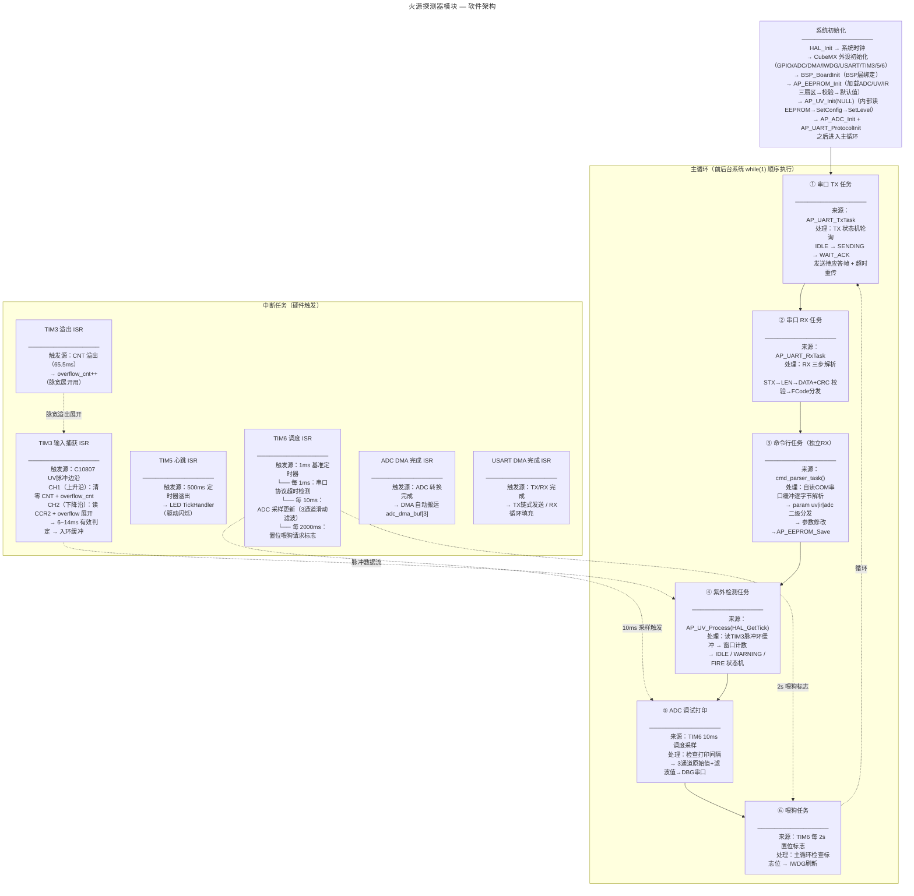

# 火源探测器模块 — 软件架构流程图



## 任务概要

| # | 任务 | 类型 | 触发方式 | 执行频率 | 功能描述 |
|---|------|------|----------|----------|----------|
| ① | 串口 TX | 轮询 | 主循环每次迭代 | ~1kHz | 发送缓冲帧 → 等 ACK → 超时重传 |
| ② | 串口 RX | 轮询 | 主循环每次迭代 | ~1kHz | 三步解析串口协议帧 → FCode 分发 |
| ③ | 命令行 | 轮询 | 主循环每次迭代 | ~1kHz | 自读 COM 串口缓存 → 命令解析 → 参数保存 |
| ④ | 紫外检测 | 轮询 | 主循环每次迭代 | ~1kHz | 读TIM3脉冲 → 窗口计数 → 三态机决策 |
| ⑤ | ADC 打印 | 条件 | TIM6 10ms 采样 | 100Hz | 检查打印标志 → DBG 输出 3 通道值 |
| ⑥ | 喂狗 | 条件 | TIM6 2s 置位 | 0.5Hz | 消费 ISR 标志 → HAL_IWDG_Refresh |

## 中断任务

| 中断 | 优先级 | 触发源 | 处理内容 | 频率 |
|------|--------|--------|----------|------|
| TIM3 CH1/CH2 捕获 | 3 | UV 脉冲边沿 | CH1清零CNT / CH2读CCR2入环 | ~100Hz |
| TIM3 溢出 | 3 | CNT 回绕 | overflow_cnt++ | 每 65ms |
| TIM5 更新 | 2 | 500ms 定时 | LED 心跳闪烁 | 2Hz |
| TIM6 更新 | 2 | 1ms 定时 | ADC采样/喂狗/协议超时 | 1kHz |
| DMA1 Ch1 (ADC) | 0 | ADC 转换完成 | DMA 自动搬数 3 通道 | ~10kHz |
| DMA1 Ch4~7 (UART) | 0 | TX/RX 完成 | 链式发送/循环接收 | 按波特率 |

## 参数存储架构

### 三层分离

```
BSP 层：hal_eeprom.c
  └── BSP_EEPROM_Read/Write               EEPROM 字读写
  └── BSP_EEPROM_LoadSector/SaveSector     CRC 校验 + 读/写模板

AP 层：ap_eeprom.c
  └── AP_EEPROM_Init()                    加载 3 个扇区
  └── AP_EEPROM_ADC_Get/Save/Reset        ADC 参数
  └── AP_EEPROM_UV_Get/Save/Reset         UV 参数
  └── AP_EEPROM_IR_Get/Save/Reset         IR 参数

公共模块：crc16.c
  └── CRC16_Modbus()                      串口协议校验
  └── CRC16_CCITT()                       EEPROM 存储校验
```

### EEPROM 扇区布局（0x08080000 ~ 0x08083FFF，16KB）

| 地址 | 结构体 | 内容 |
|------|--------|------|
| `0x08080000` | `ADC_Param` | 3 路 ADC 阈值 |
| `0x08080040` | `UV_Param` | sensitivity + thr/win/cfm/clr min/max 范围 |
| `0x08080080` | `IR_Param` | 3 路 × (threshold, hysteresis, filter_shift) |
| `0x080800C0+` | 预留 | 64B/扇区，未来扩展 |

## 初始化顺序

```c
BSP_BoardInit();                        // BSP 驱动绑定
AP_EEPROM_Init();                       // 加载 EEPROM 三扇区（魔数+CRC校验）
AP_UV_Init(NULL);                       // 内部：读EEPROM→SetConfig→SetLevel
AP_ADC_Init();                          // 启动ADC DMA
AP_UART_ProtocolInit();                 // 清协议缓冲
// → while(1) 主循环
```

## 关键数据流

```
C10807 UV  →  TIM3 CH1/CH2  →  TIM 环缓冲  →  AP_UV 窗口计数  →  FIRE标志
（PA6）        双通道独立捕获                  通道内阈值线性插值    三态机

热电堆×3  →  ADC1 + DMA     →  adc_dma_buf[3]  →  AP_ADC 滑动滤波  →  DBG串口
(PC0/1/2)    3通道连续扫描          BSP_ADC_ReadValue(ch)

EEPROM     →  AP_EEPROM_Init →  内存参数副本   →  AP_UV/IR 初始化
0x08080000   魔数+CRC校验        Get接口            SetConfig+SetLevel

命令行     →  COM 串口 RX  →  cmd_parser_task  →  AP_EEPROM_Save
            自读缓冲            param uv/ir/adc     写入 EEPROM

主机指令   →  USART1 RX DMA →  RX 环缓冲       →  AP_UART_RxTask → FCode处理
应答/上报  →  AP_UART_TxTask →  TX 环缓冲       →  USART1 TX DMA  → 主机

喂狗       →  TIM6 每 2s 置位 →  主循环判断      →  HAL_IWDG_Refresh
            ISR                BSP_IWDG_CheckAndRefresh
```
