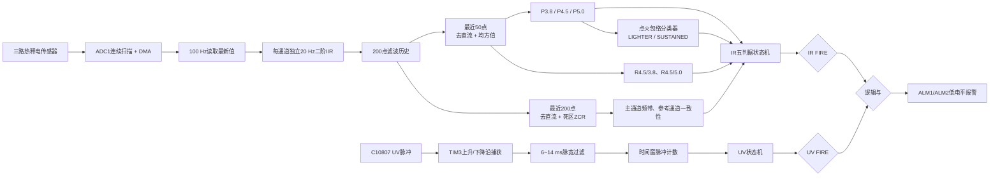
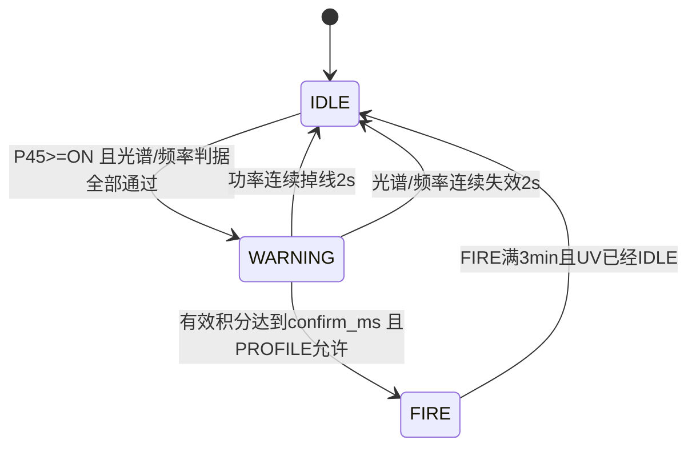
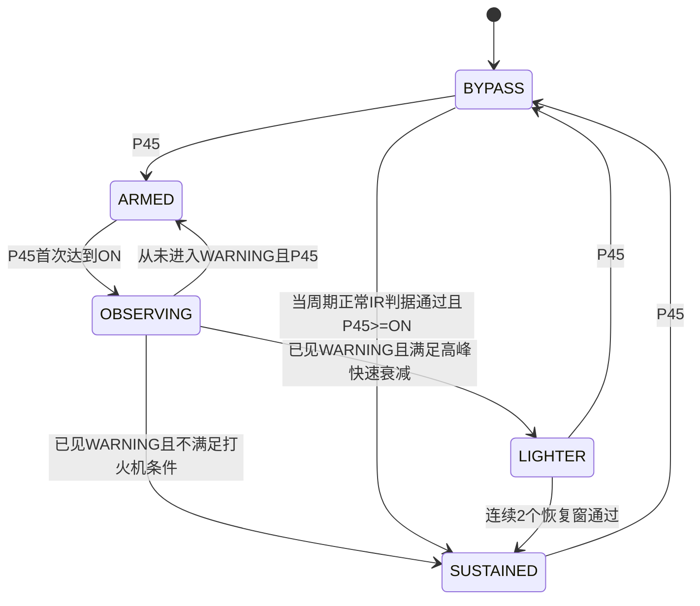
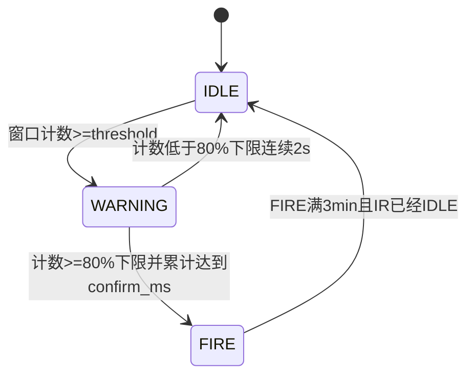

# 火源识别模块当前算法实现说明

> 文档性质：按当前仓库代码反向整理的实现说明，不是理想化设计稿。  
> 代码基线：工作区当前版本，包含尚未提交的点火包络分类与恢复逻辑。  
> 更新时间：2026-07-24。  
> 适用模块：三通道红外热释电检测、紫外脉冲检测、双传感器组合报警。

## 1. 文档目的

本文用于说明当前固件实际执行的火焰检测算法，包括：

- 三通道红外 ADC 数据如何采集、滤波和形成特征；
- 红外功率、光谱比、过零率和频率一致性如何计算；
- 红外 `IDLE -> WARNING -> FIRE` 状态机如何积累和丢弃证据；
- 点火包络分类器如何区分打火机瞬时测试火焰与持续燃烧；
- 已判定为打火机后，如何恢复为真实持续火焰；
- 紫外脉冲如何捕获、过滤、计数和确认；
- 灵敏度 0~9 如何映射为实际阈值和确认时间；
- 红外与紫外如何组合为最终硬件报警；
- EEPROM、手动 ZCR 死区标定、调试日志和测试模式的实际行为；
- 当前实现仍存在的边界条件、部署假设和后续标定重点。

本文以以下文件为主要依据：

| 层级 | 文件 | 作用 |
|---|---|---|
| 系统调度 | `Core/Src/main.c` | 初始化、主循环、10 ms 任务标志、最终报警融合 |
| ADC 驱动 | `Core/Src/adc.c`、`Code/bsp/src/hal_adc.c` | ADC1 三通道连续扫描和 DMA 最新值 |
| UV 捕获 | `Core/Src/tim.c`、`Code/bsp/src/hal_tim.c` | TIM3 双边沿脉宽捕获和底层脉冲缓存 |
| IR 算法 | `Code/ap/src/ap_ir.c` | 红外信号链、五判据、状态机、点火包络分类 |
| UV 算法 | `Code/ap/src/ap_uv.c` | UV 滑动时间窗计数和状态机 |
| 参数管理 | `Code/ap/src/ap_eeprom.c` | 默认参数、合法性校验、EEPROM 读写和版本迁移 |
| 公共配置 | `Code/ap/inc/ap_util.h` | 测试模式、算法日志、FIRE 自动清除时间 |

## 2. 当前编译和运行模式

### 2.1 编译开关

当前 `Code/ap/inc/ap_util.h` 中：

```c
// #define IR_TEST_MODE
#define AP_ALGO_DEBUG_ENABLE 1
#define AP_FIRE_AUTO_CLEAR_MS (3UL * 60UL * 1000UL)
```

因此当前固件行为是：

- `IR_TEST_MODE` 未定义，运行正常应用检测流程；
- `AP_ALGO_DEBUG_ENABLE` 已定义，编译红外、紫外和组合报警调试日志；
- IR 和 UV 的 FIRE 名义自动保持时间均为 3 分钟；
- 命令行任务始终运行；
- `AP_UART_TxTask()` 和 `AP_UART_RxTask()` 在 `main.c` 中目前被注释，通信协议状态机实际没有运行；
- 最终报警串口上报 `AP_UART_Send()` 也处于注释状态；
- 当前有效报警输出只有 ALM1、ALM2 硬件低电平和调试日志。

### 2.2 主循环实际顺序

正常模式下主循环关键顺序如下：

```text
cmd_parser_task()
    ->
AP_UV_Task()
    ->
AP_IR_Task()
    ->
检查 UV_STATE_FIRE && IR_STATE_FIRE
    ->
BSP_ALARM_Set()/Reset()
    ->
BSP_IWDG_CheckAndRefresh()
```

红外采样不是依靠主循环速度直接触发，而是由 TIM6 周期中断产生 10 ms 请求：

```text
TIM6 1 ms中断
    -> cnt_task++
    -> 每10次调用 task_10ms()
    -> AP_IR_FeedIsr() 仅置 feed_pending=1

主循环
    -> AP_IR_Task()
    -> 原子读取并清除 feed_pending
    -> 读取一组三通道ADC最新值
    -> 更新特征和状态机
```

设计采样周期为 10 ms，即 100 Hz。

`feed_pending` 是单比特标志，不是计数器。如果主循环阻塞超过一个或多个 10 ms 周期，多次采样请求会合并成一次，算法不会补采丢失的历史点。因此当前算法成立的时间前提是：正常主循环不能长期阻塞 10 ms 以上。

## 3. 总体算法架构



红外和紫外各自独立完成 `IDLE -> WARNING -> FIRE`。最终报警不是任意一路触发，而是：

```text
FINAL_FIRE = (IR_STATE_FIRE) AND (UV_STATE_FIRE)
```

## 4. 红外数据采集和通道约定

### 4.1 ADC 配置

ADC1 当前配置：

- 12 位分辨率，右对齐；
- 三通道扫描；
- 软件启动；
- 连续转换；
- DMA 连续请求；
- DMA 循环模式；
- 每通道采样时间 384 ADC cycles；
- DMA 缓冲为三个 `uint16_t`。

CubeMX 扫描顺序为：

| DMA 索引 | ADC Rank | ADC 输入 | GPIO | CubeMX 标签 |
|---:|---:|---|---|---|
| 0 | 1 | ADC_IN12 | PC2 | `IR_OUT_1` |
| 1 | 2 | ADC_IN11 | PC1 | `IR_OUT_2` |
| 2 | 3 | ADC_IN10 | PC0 | `IR_OUT_3` |

算法不做二次重排，`AP_ADC_GetLatest(ch)` 直接读取 `adc_dma_buf[ch]`。当前 `ap_ir.c` 的逻辑解释是：

| 算法索引 | 逻辑波段 | 实际 DMA 来源 |
|---:|---|---|
| `IR_CH_REF_A = 0` | 3.8 um | DMA[0]，ADC_IN12/PC2 |
| `IR_CH_MAIN = 1` | 4.5 um | DMA[1]，ADC_IN11/PC1 |
| `IR_CH_REF_B = 2` | 5.0 um | DMA[2]，ADC_IN10/PC0 |

这意味着当前 PCB/传感器接线必须满足上述实际顺序。`ap_ir.h` 中部分引脚注释仍按 PC0/PC1/PC2 顺序描述波段，不能代替 DMA Rank 的实际顺序。

### 4.2 ADC 快照语义

DMA 持续循环更新三个半字。红外任务每 10 ms 顺序读取三个数组元素，没有：

- 暂停 DMA；
- 双缓冲；
- DMA 序列完成快照；
- 两次一致性读取。

因此三路数据是“读取时刻附近的最新值”，不是严格硬件原子快照。当前算法接受三个 Rank 之间极短的转换时间差，并通过 0.5 s/2 s 特征窗口消除该差异。

## 5. 红外预处理链

### 5.1 连续 IIR 低通

每个新 ADC 点只进入一次二阶 Butterworth 低通滤波器：

- 采样率：`fs = 100 Hz`；
- 截止频率：`fc = 20 Hz`；
- 三通道分别维护独立的 `x1/x2/y1/y2` 状态；
- 使用 Q15 定点系数和 64 位累加；
- 第一个 ADC 样本用于预充输入、输出状态，避免从 0 启动造成虚假瞬态。

差分方程：

```text
y[n] = b0*x[n] + b1*x[n-1] + b2*x[n-2]
       - a1*y[n-1] - a2*y[n-2]
```

Q15 系数：

| 系数 | Q15 整数 | 约等于 |
|---|---:|---:|
| `b0` | 6770 | 0.2066 |
| `b1` | 13543 | 0.4133 |
| `b2` | 6770 | 0.2066 |
| `a1` | -12104 | -0.3695 |
| `a2` | 6416 | 0.1958 |

实现计算：

```c
acc = b0*x0 + b1*x1 + b2*x2 - a1*y1 - a2*y2;
y0 = acc >> 15;
```

### 5.2 历史缓存

每通道保存：

- `raw[200]`：ADC 原始值，主要供测试模式使用；
- `filtered[200]`：20 Hz IIR 输出，供正式算法使用；
- `head`：下一写入位置；
- `count`：已有有效样本数，最大 200。

缓存时长为：

```text
200 samples / 100 Hz = 2 s
```

正式算法必须等待三通道均积累满 200 点后才开始判定。因此：

- 上电后约 2 s 内 IR 保持 `IDLE`；
- `AP_IR_Reset()` 清空历史和 IIR 状态后，也需要重新等待约 2 s。

### 5.3 短窗和长窗分离

当前实现故意使用两个不同长度的滚动窗口：

| 特征 | 样本数 | 时间长度 | 原因 |
|---|---:|---:|---|
| DC/功率 | 50 | 0.5 s | 保持既有测试标定口径和较快响应 |
| ZCR | 200 | 2.0 s | 提高低频火焰闪烁的频率分辨率 |

扩大 ZCR 窗口不会扩大功率窗口，因此不会把原 0.5 s 功率特征改成 2 s 慢响应。

## 6. 红外特征计算

### 6.1 去直流

对每个窗口先计算算术均值：

```text
mean = sum(x[i]) / N
```

再得到交流分量：

```text
ac[i] = x[i] - mean
```

DC 去除分别在 50 点功率窗口和 200 点 ZCR 窗口独立执行。

### 6.2 平均能量/均方值

三通道功率定义为最近 50 个 IIR 输出去直流后的均方值：

```text
Pch = sum(ac[i]^2) / 50
```

实现使用 `uint64_t` 累加平方，最终结果大于 `UINT32_MAX` 时饱和。

需要特别注意：

- 结构字段名保留为 `power_x1000`；
- 当前计算没有再乘 `1000`，也没有除以 `50` 以外的显示缩放；
- 当前 P 值实际单位是 ADC count 的平方，即 `ADC_count^2`；
- 阈值 `12000~22000`、`OFF`、峰值 `100000`、恢复均值 `50000` 都与这个直接均方值口径对应。

### 6.3 光谱比

使用均方值计算两个固定点光谱比：

```text
R45_38_x1000 = P4.5 * 1000 / P3.8
R45_50_x1000 = P4.5 * 1000 / P5.0
```

例如：

- `1500` 表示 1.500；
- `43500` 表示 43.500。

分母为 0 时的当前处理：

```text
if denominator == 0 and numerator > 0:
    ratio = UINT32_MAX
if denominator == 0 and numerator == 0:
    ratio = 0
```

因此参考通道功率为 0、主通道有能量时，比例按趋于无穷处理，可以通过“比例大于下限”判据，不会因为整数除零被强制判为 0。

### 6.4 过零率

ZCR 使用最近 200 点滤波数据，重新去直流后计算。

每个样本先按死区分为三种状态：

```text
ac[i] > +dead_zone  -> +1
ac[i] < -dead_zone  -> -1
其他                -> 0，忽略
```

遍历时：

- 死区内样本不改变上一个有效符号；
- 仅当当前有效符号与上一个有效符号相反时，过零计数加 1；
- 小幅零点噪声不会形成高频正负抖动。

频率公式：

```text
ZCR_Hz = zero_cross_count / (2 * window_time_s)
```

当前窗口为 2 s，因此每增加一次有效符号翻转，结果变化：

```text
1 / (2 * 2 s) = 0.25 Hz
```

判据中使用 `ZCR_x10 = round(ZCR_Hz * 10)` 的整数形式。

## 7. ZCR 死区及手动标定

### 7.1 上电行为

上电不会自动标定。`AP_IR_Init()` 直接从 EEPROM 加载三通道固定死区：

| 通道 | 默认死区 |
|---|---:|
| 3.8 um | 15 |
| 4.5 um | 15 |
| 5.0 um | 10 |

这样避免每次上电时环境、启动瞬态或已有火焰改变判据。

### 7.2 手动标定流程

命令：

```text
ir cal start
ir cal status
ir cal cancel
```

启动限制：

- IR 状态必须为 `IDLE`；
- 已经处于预热或采集中时拒绝重复启动。

标定时序：

1. 先等待 5 s 预热；
2. 再采集 5 个互不重叠的 2 s 窗口；
3. 每个窗口、每个通道取去直流绝对幅度的 P90；
4. 每通道对 5 个 P90 取中位数；
5. 中位数乘 1.5，并向上取整；
6. 结果限制到 `[10, 30]`；
7. 先写 EEPROM；
8. EEPROM 保存成功后才替换当前运行死区。

公式：

```text
noise_window = P90(|ac|)
noise_ch = median(noise_window[0..4])
dead_zone_ch = clamp(ceil(noise_ch * 1.5), 10, 30)
```

标定总时间约为：

```text
5 s预热 + 5 * 2 s采样 = 15 s
```

如果采集期间 IR 离开 `IDLE`，标定进入 `ERROR`，不写入新的死区。

## 8. 红外五项判据

红外进入 WARNING 的条件可表示为：

```text
C1 && C2 && C3 && C4 && C5
```

### 8.1 判据 C1：4.5 um 主通道功率

```text
P4.5 >= power_threshold
```

`power_threshold` 随灵敏度插值，默认范围为：

```text
等级0: 12000
等级9: 22000
```

### 8.2 判据 C2：4.5/3.8 光谱比

```text
R45_38_x1000 >= 1500
```

阈值固定，不随灵敏度变化。

### 8.3 判据 C3：4.5/5.0 光谱比

```text
R45_50_x1000 >= 1300
```

阈值固定，不随灵敏度变化。

### 8.4 判据 C4：4.5 um 主通道闪烁频率

严格进入 WARNING 时：

```text
1.0 Hz <= ZCR4.5 <= 20.0 Hz
```

WARNING 保持阶段上下限各放宽 0.3 Hz：

```text
0.7 Hz <= ZCR4.5 <= 20.3 Hz
```

放宽值 `0.3 Hz` 接近当前 2 s ZCR 窗口的一个量化档，用于减少边界抖动。

### 8.5 判据 C5：有效参考通道频率一致性

参考通道不是无条件参与 ZCR 一致性判断。先判断该参考通道功率是否足够：

```text
valid_rms = dead_zone * 2
valid_power = valid_rms^2
reference_valid = Preference >= valid_power
```

默认死区下，有效功率下限约为：

| 通道 | 死区 | 有效功率下限 |
|---|---:|---:|
| 3.8 um | 15 | 900 |
| 5.0 um | 10 | 400 |

仅有效参考通道参与频率一致性：

```text
abs(ZCR4.5 - ZCR3.8) <= 2.0 Hz
abs(ZCR4.5 - ZCR5.0) <= 2.0 Hz
```

差值等于 2.0 Hz 时允许通过，只有严格大于 2.0 Hz 才失败。

弱参考通道仍参与光谱比，但不使用其噪声 ZCR 否决主通道火焰。

## 9. 红外灵敏度

### 9.1 等级方向

当前统一约定：

```text
level 0 = 最灵敏
level 9 = 最迟钝
```

红外仅以下两项随等级变化：

- 4.5 um 进场功率 `power_threshold`；
- WARNING 确认时间 `confirm_ms`。

以下参数固定：

- `R45/38` 阈值；
- `R45/50` 阈值；
- ZCR 上下限；
- ZCR 死区；
- 频率一致性差值；
- 点火包络分类门槛和时间窗；
- FIRE 保持时间。

### 9.2 插值公式

```text
value(level) =
    min + floor((max - min) * level / 9)
```

默认红外参数表：

| 等级 | ON 功率阈值 | OFF=ON×40% | 确认时间 ms |
|---:|---:|---:|---:|
| 0 | 12000 | 4800 | 200 |
| 1 | 13111 | 5244 | 511 |
| 2 | 14222 | 5688 | 822 |
| 3 | 15333 | 6133 | 1133 |
| 4 | 16444 | 6577 | 1444 |
| 5 | 17555 | 7022 | 1755 |
| 6 | 18666 | 7466 | 2066 |
| 7 | 19777 | 7910 | 2377 |
| 8 | 20888 | 8355 | 2688 |
| 9 | 22000 | 8800 | 3000 |

表中数值只代表 EEPROM 默认值。现场通过命令修改 min/max 后，实际表会随之改变。

## 10. 红外报警状态机

### 10.1 状态定义

```text
IR_STATE_IDLE
IR_STATE_WARNING
IR_STATE_FIRE
```



### 10.2 IDLE -> WARNING

必须在同一处理周期满足：

```text
P45 >= ON
R45/38 >= threshold
R45/50 >= threshold
ZCR45 in strict range
所有有效参考通道频率一致
```

迁移时：

- `valid_accum_ms = 0`；
- 清除功率和判据 drop 计时；
- 将主功率迟滞标记为已激活；
- 同步通知点火包络分类器本次观察已经进入 WARNING。

### 10.3 WARNING 功率迟滞

功率有两个阈值：

```text
ON  = 当前等级进场阈值
OFF = ON * 40%
```

WARNING 中：

| P45 范围 | 行为 |
|---|---|
| `P45 >= ON` | 功率有效，清除功率掉线 |
| `OFF <= P45 < ON` 且此前已激活 | 迟滞保持有效 |
| `P45 < OFF` | 开始或继续功率掉线 |

连续低于 OFF 达到 2000 ms 后，WARNING 复位为 IDLE。

### 10.4 WARNING 光谱/频率保持

功率可用时，再检查：

- 两项固定光谱比；
- 放宽 0.3 Hz 后的主 ZCR 频带；
- 有效参考通道的频率一致性。

当前确认积分行为：

```text
本周期全部判据通过:
    valid_accum_ms += 10 ms，最大到confirm_ms

本周期判据失败:
    valid_accum_ms -= 10 ms，最小到0
```

如果功率不可用但仍处于 2 s 掉线宽限期，积分同样每周期回退 10 ms。

因此当前实现不是“失败时完全暂停积分”，而是：

- 通过时加 10 ms；
- 失败时减 10 ms；
- 单独记录连续失败时长；
- 连续失败满 2 s 才撤销 WARNING。

### 10.5 WARNING -> FIRE

需要同时满足：

```text
当前功率可用
当前光谱/频率判据通过
valid_accum_ms >= confirm_ms
点火包络分类器允许报警
```

如果点火包络分类结果为 `LIGHTER`：

- 红外保持 WARNING；
- 有效积分可保持在饱和值；
- 不允许进入 FIRE；
- 点火包络恢复为 `SUSTAINED` 后可在后续周期进入 FIRE。

### 10.6 FIRE 行为

进入 FIRE 后：

- 不再检查功率；
- 不再检查光谱比；
- 不再检查 ZCR；
- 不再根据火焰消失即时退出；
- 只检查固定超时和另一传感器状态。

IR 当前退出条件：

```text
IR_FIRE持续时间 >= 3 min
AND
UV_STATE == IDLE
```

## 11. 点火包络分类器

### 11.1 目的

正常红外五判据回答的是：

> 当前信号是否具有火焰的功率、光谱和闪烁特征？

点火包络分类器回答的是：

> 本次从安静背景开始的启动过程，是不是“启动峰值极高、随后快速衰减”的近距离打火机测试火焰？

两套逻辑每 10 ms 并行运行：

- PROFILE 不停止 IR 进入 WARNING；
- PROFILE 不停止 WARNING 有效积分；
- 只有 WARNING 已满足 FIRE 条件时，才读取 PROFILE 结论决定是否允许进入 FIRE。

### 11.2 PROFILE 状态

```text
IR_PROFILE_BYPASS
IR_PROFILE_ARMED
IR_PROFILE_OBSERVING
IR_PROFILE_LIGHTER
IR_PROFILE_SUSTAINED
```



### 11.3 BYPASS 和重新布防

PROFILE 初始化和释放后进入 BYPASS。

BYPASS 的含义是：

- 尚未取得完整的“安静背景 -> 点火上升沿”；
- 当前不能可靠区分启动瞬态；
- 等待 P45 连续低于 OFF 1000 ms。

满足安静时间后进入 ARMED。

如果 P45 在安静累计期间恢复到 OFF 以上，累计清零。

### 11.4 ARMED 和观察起点

ARMED 等待：

```text
P45 >= 当前等级ON
```

第一次达到 ON 的周期立即进入 OBSERVING，并记录：

```text
phase_start_ms = now
early_peak = 当前P45
```

启动观察不等待光谱比和 ZCR，目的是避免五判据较晚通过时已经错过初始峰值。

### 11.5 峰值窗口

时间范围：

```text
t = 0 ~ 1.5 s
```

持续更新：

```text
early_peak = max(early_peak, P45)
```

P45 本身已经是最近 0.5 s 的滚动均方值，因此这里记录的是“平滑能量包络峰值”，不是原始 ADC 单点峰值。

### 11.6 稳定窗口

时间范围：

```text
t = 1.5 ~ 3.0 s
```

最多持续 1.5 s，并与峰值窗口不重叠。

每 10 ms：

```text
late_samples++

if P45 >= OFF:
    late_sum += P45
    late_high_samples++
```

稳定能量：

```text
LATE = late_sum / late_high_samples
```

有效占空比：

```text
DUTY1000 = late_high_samples * 1000 / late_samples
```

低于 OFF 的样本：

- 不参与 LATE 均值；
- 仍进入 DUTY1000 分母；
- 避免低谷把真实火焰的有效能量均值压低；
- 同时保留该窗口内火焰是否持续存在的信息。

### 11.7 提前结束稳定窗

正常情况在 t=3.0 s 完成分类。

如果 WARNING 有效积分先达到 `confirm_ms`，即红外已经准备进入 FIRE，则：

- 在进入 FIRE 前立即调用 PROFILE 完成函数；
- 使用当前已经采集到的稳定段样本；
- 不强制等待稳定窗补满 1.5 s；
- 保证日志顺序是 PROFILE 结果在前，FIRE 状态迁移在后；
- 不为了分类延迟正常火警。

如果 FIRE 准备时间早于 t=1.5 s，稳定样本数为 0。当前采取漏报优先策略：

```text
无稳定有效样本 -> SUSTAINED -> 允许报警
```

### 11.8 初次打火机分类条件

计算：

```text
R1000 = LATE * 1000 / PEAK
```

只有同时满足以下三项才判为 LIGHTER：

```text
PEAK >= 100000
late_high_samples != 0
R1000 < 400
```

即：

```text
启动峰值至少10万
并且存在OFF以上的稳定段样本
并且后期有效均值低于启动峰值的40%
```

其他情况均判为 SUSTAINED。

初次分类时 `DUTY1000` 只输出到日志，当前不参与 LIGHTER 判定。恢复阶段才使用 60% 占空比。

### 11.9 没有进入 WARNING 的短瞬态

PROFILE 为了捕获峰值，会在 P45 达到 ON 时先于五判据启动。

如果整个观察期间始终没有进入 IR WARNING，并且 P45 又连续低于 OFF 满 1 s：

```text
OBSERVING -> ARMED
```

该事件：

- 不输出 LIGHTER/SUSTAINED 终态；
- 不等待额外 2 s 终态释放；
- 这 1 s 安静时间直接视为下一次点火沿的重新布防条件。

如果观察已超过 3 s，但信号仍不安静且一直没有进入 WARNING，PROFILE 会保留在 OBSERVING，直到后续进入 WARNING 或满足无 WARNING 安静取消条件。

### 11.10 热启动接纳

以下场景可能没有完整冷启动沿：

- 设备上电时火焰已经存在；
- 火焰持续波动，P45 始终无法低于 OFF 满 1 s；
- PROFILE 处于 BYPASS，但正常 IR 判据已经确认当前是有效火焰。

此时只有在同一个当前周期满足：

```text
PROFILE == BYPASS
P45 >= ON
当前正常IR光谱/频率判据通过
```

才执行：

```text
BYPASS -> SUSTAINED
```

热启动不能仅凭上一周期遗留的 WARNING 状态触发，避免 LIGHTER 刚释放后因 WARNING 的 2 s 掉线宽限误认持续火焰。

## 12. LIGHTER 后恢复为真实火焰

### 12.1 恢复动机

LIGHTER 不是永久锁存。现场可能出现：

- 酒精盆点火瞬间也产生很高轰燃峰值；
- 初次形态暂时被识别为 LIGHTER；
- 后续真实火盆稳定维持较高能量；
- 此时必须允许“干扰 -> 真实火焰”的单向变化。

反方向不允许：

```text
SUSTAINED 不会降级为 LIGHTER
```

### 12.2 恢复窗口

LIGHTER 分类完成后，每 1 s 独立统计一个恢复窗口。

每个窗口：

```text
total_samples = 所有10ms周期数
valid_samples = P45>=OFF的周期数
valid_mean = sum(P45 | P45>=OFF) / valid_samples
duty_x1000 = valid_samples * 1000 / total_samples
ratio_x1000 = valid_mean * 1000 / early_peak
```

低于 OFF 的样本不进入均值，只进入占空比分母。

### 12.3 固定值和相对值并行

单一固定门槛会受以下因素影响：

- 火源距离；
- 镜片透光率；
- 热释电器件增益；
- 光路一致性；
- 火盆规模和燃料；
- 启动峰值是否出现轰燃。

单一相对比例也有问题：

- 酒精盆初始峰值可能达到 170 万；
- 后续稳定火焰维持 6 万~几十万；
- 相对峰值可能低于 40%，但绝对能量已经明显属于真实火焰。

因此当前恢复采用“固定值 OR 相对值”：

```text
absolute_pass = valid_mean >= 50000
relative_pass = ratio_x1000 >= 400
```

完整窗口条件：

```text
window_pass =
    valid_samples > 0
    AND duty_x1000 >= 600
    AND (absolute_pass OR relative_pass)
```

即：

```text
有效占比至少60%
并且
(
    有效均值至少5万
    或
    有效均值恢复到初始峰值的40%以上
)
```

### 12.4 连续确认

需要连续两个 1 s 窗口通过：

```text
HIT 1/2 -> 保持LIGHTER
HIT 2/2 -> LIGHTER转SUSTAINED
```

任意一个窗口失败：

```text
recovery_pass_windows = 0
```

该规则用于防止打火机稳定燃烧过程中偶发一个窗口超过 5 万，就立即升级为真实火焰。

升级为 SUSTAINED 后，若 IR WARNING 积分已经满足，可以在同一轮或下一轮状态处理中进入 IR FIRE。

### 12.5 LIGHTER/SUSTAINED 释放

两种终态统一使用：

```text
P45 < OFF 连续2000 ms
```

满足后：

```text
LIGHTER/SUSTAINED -> BYPASS
```

只要期间 P45 恢复到 OFF 以上，释放计时立即清零。

释放后还必须在 BYPASS 中重新安静 1 s 才能进入 ARMED，防止旧火源低谷被当成新的启动沿。

## 13. PROFILE 与 IR 状态机的并行关系

每个 10 ms 红外周期的大致顺序：

```text
1. 计算三通道P、ZCR和光谱比
2. ignition_profile_update()
3. 执行IR IDLE/WARNING/FIRE状态机
4. 若WARNING准备进入FIRE:
     ignition_profile_allows_fire()
5. LIGHTER阻断FIRE；其他状态放行
```

关键语义：

| 情况 | IR WARNING 积分 | 是否允许 IR FIRE |
|---|---|---|
| PROFILE ARMED/BYPASS | 正常累计 | 放行，避免高灵敏度漏报 |
| PROFILE OBSERVING | 正常累计 | FIRE 就绪时先提前分类 |
| PROFILE LIGHTER | 正常累计至饱和 | 阻断 |
| PROFILE SUSTAINED | 正常累计 | 放行 |
| LIGHTER 恢复为 SUSTAINED | 不清积分 | 可快速进入 FIRE |

## 14. 紫外脉冲采集

### 14.1 TIM3 捕获

C10807 的 UV 输出按不规则高电平脉冲处理。

TIM3 配置：

- 定时器时钟 32 MHz；
- 预分频 32，得到 1 MHz；
- 1 tick = 1 us；
- ARR = 65535；
- CH1 捕获上升沿；
- CH2 通过同一输入的间接通道捕获下降沿。

捕获过程：

```text
上升沿:
    overflow_cnt = 0
    rising_tick_ms = HAL_GetTick()
    TIM3 CNT = 0

下降沿:
    width_ticks = CCR2 + overflow_cnt * (ARR+1)
    width_us = width_ticks * tick_us
    timestamp_ms = 上升沿时间
```

有效脉冲才进入底层环形缓冲：

```text
pw_min_us <= width_us <= pw_max_us
```

默认：

```text
6000 us <= width <= 14000 us
```

脉宽上下限可通过命令修改并写入 EEPROM。

### 14.2 两级缓存

UV 数据有两级缓存：

| 层级 | 容量 | 满时行为 |
|---|---:|---|
| BSP TIM3 环形缓冲 | 128 个脉冲 | 覆盖最旧脉冲 |
| AP UV 历史 | 64 个脉冲 | 覆盖最旧脉冲 |

`AP_UV_Feed()` 每次最多从底层读取 64 个脉冲。正常主循环频繁调用时，剩余脉冲会留在底层等待下一轮。

## 15. 紫外时间窗计数

每次 `AP_UV_Process(now)`：

1. 从 AP 历史头部删除所有 `now - timestamp > window_ms` 的旧脉冲；
2. 当前 `count` 即检测窗口内有效脉冲数；
3. 使用该计数更新 UV 状态机。

当前 UV 只使用：

- 脉冲是否在有效脉宽范围；
- 当前时间窗内的有效脉冲总数。

脉冲宽度和各自时间戳用于底层过滤、窗口维护和测试打印，不进入更复杂的模式识别。

## 16. 紫外灵敏度

### 16.1 随等级变化的参数

UV 以下三项随 0~9 级插值：

- 窗口脉冲阈值 `threshold`；
- 时间窗 `window_ms`；
- WARNING 确认时间 `confirm_ms`。

默认端点：

```text
threshold: 5 -> 24
window:    1000 ms -> 3500 ms
confirm:   0 ms -> 3500 ms
```

等级越大：

- 需要的脉冲数越多；
- 观察窗口越长；
- 确认时间越长；
- 整体越迟钝。

### 16.2 默认等级表

| 等级 | 入场脉冲数 | 80%掉线下限 | 窗口 ms | 确认 ms |
|---:|---:|---:|---:|---:|
| 0 | 5 | 4 | 1000 | 0 |
| 1 | 7 | 6 | 1277 | 388 |
| 2 | 9 | 8 | 1555 | 777 |
| 3 | 11 | 9 | 1833 | 1166 |
| 4 | 13 | 11 | 2111 | 1555 |
| 5 | 15 | 12 | 2388 | 1944 |
| 6 | 17 | 14 | 2666 | 2333 |
| 7 | 19 | 16 | 2944 | 2722 |
| 8 | 21 | 17 | 3222 | 3111 |
| 9 | 24 | 20 | 3500 | 3500 |

掉线下限采用向上取整：

```text
drop_threshold = ceil(threshold * 80%)
```

## 17. 紫外状态机



### 17.1 IDLE -> WARNING

```text
pulse_count >= threshold
```

进入 WARNING 时：

- `valid_accum_ms = 0`；
- 记录 `warning_update_ms = now`；
- 清除掉线状态。

### 17.2 WARNING 确认

UV 不假设主循环固定周期，而是使用两次处理的实际时间差：

```text
elapsed_ms = now - warning_update_ms
```

如果：

```text
pulse_count >= ceil(threshold * 80%)
```

则：

- 清除掉线状态；
- `valid_accum_ms += elapsed_ms`，最大到 `confirm_ms`；
- 达到确认时间后进入 FIRE。

如果低于 80% 下限：

- `valid_accum_ms -= elapsed_ms`，最小为 0；
- 开始连续掉线计时；
- 连续低于下限 2000 ms 后回到 IDLE。

### 17.3 FIRE

UV FIRE 不根据脉冲消失立即清除。

当前退出条件：

```text
UV_FIRE持续时间 >= 3 min
AND
IR_STATE == IDLE
```

## 18. 最终组合报警

主循环每轮计算：

```text
now_fire =
    (AP_UV_GetState() == UV_STATE_FIRE)
    &&
    (AP_IR_GetState() == IR_STATE_FIRE)
```

状态沿行为：

| 组合状态变化 | 动作 |
|---|---|
| 0 -> 1 | `BSP_ALARM_Set()`，ALM1/ALM2 输出低电平 |
| 1 -> 0 | `BSP_ALARM_Reset()`，ALM1/ALM2 输出高电平 |

报警是电平输出，低电平有效。

调试开启时输出：

```text
[ALARM] T<ms> ON UV=<state> IR=<state>
[ALARM] T<ms> OFF UV=<state> IR=<state>
```

当前串口协议火警上报代码被注释，没有发送正式协议帧。

## 19. EEPROM 参数体系

### 19.1 扇区

| 扇区 | 地址 | 内容 |
|---|---|---|
| ADC | `0x08080000` | 三路 ADC 阈值 |
| UV | `0x08080040` | UV 灵敏度、阈值/窗口/确认端点、脉宽、打印窗 |
| IR | `0x08080080` | IR 灵敏度、功率端点、固定光谱/频率、确认端点、ZCR死区 |

每个参数组使用：

- 魔数；
- 版本；
- 结构体长度；
- CRC16-CCITT；
- 业务范围校验。

CRC 正确但参数语义非法时也恢复默认值。

### 19.2 当前参数版本

```text
UV: EUV3，version 3
IR: EIR7，version 7
```

IR v7 将原单个固定功率阈值改为：

```text
power_min
power_max
```

并保留从有效 v6 参数迁移现场 ZCR 死区、光谱阈值、频率和确认时间的逻辑。

### 19.3 合法范围

主要约束：

| 参数 | 合法范围 |
|---|---|
| sensitivity | 0~9 |
| UV threshold | 1~64，且 min<=max |
| UV/IR 时间参数 | 0 或 100~60000 ms，具体字段另有限制 |
| UV 脉宽 | `0 < min <= max <= 65535 us` |
| IR 功率 | `0 < min <= max <= 10000000` |
| IR 光谱比 | `1~100000`，单位 ×1000 |
| IR 频率 | `10~200`，单位 ×10，即 1~20 Hz |
| IR ZCR 死区 | 10~30 |

CLI 修改参数时先保存并通过统一校验，保存成功后才切换 RAM 运行参数。

## 20. 调试日志解释

### 20.1 红外 500 ms 快照

典型格式：

```text
[IR] T132520 S=WARNING
P=26,1131,24
R1000=43500,47125
Z10=0,13,0
DZ=15,15,10
ACC=400/1755
DROP=0
REFV=0,0
PROF=OBS
```

字段：

| 字段 | 含义 |
|---|---|
| `S` | IR 报警状态 |
| `P` | P3.8、P4.5、P5.0，直接均方值 |
| `R1000` | R45/38、R45/50 |
| `Z10` | 三通道 ZCR×10 |
| `DZ` | 三通道固定过零死区 |
| `ACC` | 当前 WARNING 有效积分/目标确认时间，ms |
| `DROP` | 功率或其他判据是否处于掉线宽限 |
| `REFV` | 3.8、5.0 参考通道是否有资格参与 ZCR 一致性 |
| `PROF` | BYPASS/ARMED/OBS/LIGHTER/SUSTAINED |

### 20.2 PROFILE 初次分类

```text
PROFILE result=LIGHTER
PEAK=61998
PMIN=100000
LATE=2094
R1000=33
DUTY1000=...
VALID=x/y
LATE_MS=...
OBS=...
MODE=FULL/FIRE_READY
```

当前 `PEAK < PMIN` 时不会判 LIGHTER。判断日志时应同时查看 `PEAK`、`PMIN` 和 `R1000`，不能只看衰减比例。

### 20.3 LIGHTER 恢复日志

```text
PROFILE recovery pending
MEAN=...
RMIN=50000
R1000=...
ABS=0/1
REL=0/1
DUTY1000=...
HIT=1/2
VALID=x/y
```

| 字段 | 含义 |
|---|---|
| `MEAN` | 当前 1 s 窗内 OFF 以上有效样本均值 |
| `RMIN` | 固定恢复门槛 50000 |
| `R1000` | MEAN/初始 PEAK×1000 |
| `ABS` | 固定门槛路径是否通过 |
| `REL` | 相对 40% 路径是否通过 |
| `DUTY1000` | 有效样本占比 |
| `HIT` | 连续通过窗口数 |

### 20.4 UV 快照

```text
[UV] T49500 S=IDLE CNT=0/15 OFF=12 WIN=2388 ACC=0/1944 DROP=0 OVR=0
```

| 字段 | 含义 |
|---|---|
| `CNT` | 当前窗口脉冲数/入场阈值 |
| `OFF` | WARNING 80% 掉线下限 |
| `WIN` | 当前滑动窗口 ms |
| `ACC` | 有效确认积分/目标确认时间 |
| `DROP` | 是否正在连续掉线 |
| `OVR` | 最近日志周期 AP 历史覆盖数量 |

## 21. 测试模式

定义 `IR_TEST_MODE` 后：

- 不执行正式 IR/UV 状态机和组合报警；
- TIM6 每 10 ms 设置测试打印标志；
- 主循环按命令分别启停 IR、UV 打印；
- IR 测试输出原始 ADC、50 点均方值和分段平均能量；
- UV 每 0.5 s打印一次配置窗口内的脉冲总数；
- 支持 `mark` 插入场景分隔；
- 调试相关代码通过条件编译与正常应用隔离。

IR 测试行当前格式：

```text
raw0,raw1,raw2,pwr0,pwr1,pwr2,energy0,energy1,energy2
```

其中：

- `pwr` 为当前最近 0.5 s 均方值；
- `energy` 为完整 N 秒分段窗口的平均功率；
- 分段窗口未满时不更新定量能量；
- 窗口切换用固定标记值辅助上位机观察。

## 22. 典型场景的当前处理

### 22.1 无火背景

```text
P45通常低于OFF
-> PROFILE由BYPASS安静1s后进入ARMED
-> IR保持IDLE
-> UV保持IDLE
-> ALM高电平
```

### 22.2 短按一下打火机但未进入 WARNING

```text
P45跨过ON
-> PROFILE开始OBS并记录峰值
-> 光谱/ZCR始终未满足，IR未进入WARNING
-> P45低于OFF连续1s
-> OBS直接取消并回ARMED
-> 不产生LIGHTER终态，也不报警
```

### 22.3 近距离打火机，满足红外火焰判据

```text
安静布防
-> P45跨ON
-> 1.5s内记录很高PEAK
-> IR进入WARNING并正常积分
-> 后段LATE显著低于PEAK
-> PEAK>=100000且LATE/PEAK<40%
-> PROFILE=LIGHTER
-> IR积分可达到confirm_ms，但不得进入FIRE
```

### 22.4 打火机持续点着

LIGHTER 后继续按 1 s 窗口检查：

- 如果平均能量低、占空比不足或只有单个高窗，保持 LIGHTER；
- 如果连续两个窗口满足 `DUTY>=60%`，并且绝对 5 万或相对 40% 任一路成立，则升级 SUSTAINED；
- 升级后可进入 IR FIRE。

这意味着“长期、强烈、持续的打火机火焰”仍可能被视为真实持续火焰，这是当前恢复逻辑的设计结果，而不是永久屏蔽所有打火机。

### 22.5 酒精盆初始轰燃被暂判 LIGHTER

```text
初始PEAK可能达到几十万或上百万
-> 后段相对比例可能<40%
-> 初判LIGHTER
-> 稳定火焰后1s有效均值持续>=50000
-> ABS路径连续2窗通过
-> LIGHTER升级SUSTAINED
-> 已积累的IR WARNING证据不清零
-> 快速进入IR FIRE
```

### 22.6 远距离真实火焰

如果整体幅值较低但后期恢复到启动峰值的 40% 以上：

```text
ABS可能失败
REL可以通过
加上60%占空比和连续2窗
-> LIGHTER升级SUSTAINED
```

### 22.7 上电时已有火焰

没有安静背景，PROFILE 可能一直处于 BYPASS。

只要当前周期：

```text
P45>=ON
光谱/ZCR判据全部通过
```

则按热启动直接接纳为 SUSTAINED，不要求伪造启动峰值。

## 23. 当前实现的已知边界和风险

### 23.1 IR/UV FIRE 自动清除存在互相等待

当前代码：

```text
IR FIRE退出要求: 到3min 且 UV==IDLE
UV FIRE退出要求: 到3min 且 IR==IDLE
```

当 IR 和 UV 已经同时进入 FIRE 时，两者都会等待对方先变为 IDLE，而两者在 FIRE 中都没有其他条件清除。因此在没有外部复位或单独状态复位的情况下，组合 FIRE 可能永久保持，3 分钟自动清除无法发生。

这与“3 分钟自动消警”的注释目标不完全一致。交付前需要明确选择：

- 最终组合报警统一维护一个保持计时器；
- 或允许某一路到时先退出；
- 或明确将当前行为定义为锁存报警，只允许外部复位。

### 23.2 初次 LIGHTER 分类没有最小稳定样本数

FIRE_READY 可提前结束稳定窗。当前初次分类只要求：

```text
late_high_samples != 0
```

理论上一个有效稳定样本也可参与 LATE/PEAK 比较。高灵敏度和很短确认时间下，分类置信度会下降。当前策略优先不延迟报警，但后续可考虑增加不超过 `confirm_ms` 的最小稳定样本要求。

### 23.3 初次 LIGHTER 分类不使用稳定占空比

`DUTY1000` 在初次分类日志中只用于观察，不参与分类。当前可能把“一个很高启动峰值 + 少量 OFF 以上后段样本”识别为 LIGHTER。

恢复阶段已经使用 60% 占空比和连续两窗。是否也应给初次分类增加最小占空比，需要更多酒精、打火机和干扰源数据后决定。

### 23.4 固定 PROFILE 参数尚未进入 EEPROM

以下参数目前是编译期宏：

- 1 s 安静布防；
- 1.5 s 峰值窗；
- 最大 1.5 s 稳定窗；
- 10 万 LIGHTER 峰值门槛；
- 40% 衰减比例；
- 5 万恢复绝对门槛；
- 60% 恢复占空比；
- 连续 2 个恢复窗口。

它们不随灵敏度变化，也不能通过 CLI 现场修改。改变这些值需要重新编译。

### 23.5 功率字段命名与实际缩放不一致

`power_x1000` 名称容易让维护人员误以为功率额外乘了 1000。当前实际是直接均方值。后续如需改名，应同步 EEPROM 参数说明、调试输出、上位机和历史测试数据，不能只改局部变量。

### 23.6 AP 层与 CubeMX 注释的通道物理描述不一致

算法索引直接跟随 ADC DMA Rank。交付时必须用实物通道测试确认：

```text
DMA[0]确实对应3.8 um
DMA[1]确实对应4.5 um
DMA[2]确实对应5.0 um
```

不能仅根据 PC0/PC1/PC2 的顺序推断。

### 23.7 UV 历史容量限制

AP UV 历史最多保留 64 个脉冲。当前最大入场阈值为 24，实测主分布也低于容量，因此有余量。但如果未来扩大窗口、降低脉宽过滤或面对更高 UV 脉冲率，超过 64 后会覆盖最旧脉冲，窗口计数最多只能看到 64。

### 23.8 正常模式协议通信当前关闭

主循环中的协议 TX/RX 任务和火警协议发送均被注释。算法状态和硬件 ALM 可以工作，但外部通信主机不会收到正式火警协议消息。

### 23.9 调试日志占用串口和处理时间

`AP_ALGO_DEBUG_ENABLE=1` 时：

- IR 和 UV 每 500 ms 输出快照；
- 判据失败、drop、状态转换和 PROFILE 事件也会输出；
- 调试串口拥塞可能增加主循环负担。

正式发布前应评估关闭该宏后的行为，并确认关闭后不再编译调试状态和字符串。

## 24. 标定和验证建议

后续数据采集至少应覆盖：

| 类型 | 建议变量 |
|---|---|
| 无火背景 | 白天/夜间、太阳辐射、热设备、人员移动 |
| 打火机 | 近距离/远距离、稳定/晃动、不同方向、持续时间 |
| 酒精火盆 | 10 cm/30 cm，不同距离，点火轰燃和稳定阶段 |
| 其他燃料 | 木材、纸张、汽油/柴油、塑料等 |
| 光路变化 | 不同镜片、污染、遮挡、透光率 |
| 气流 | 无风、轻风、强风导致的火焰间歇 |
| UV 干扰 | 电弧、焊接、日光、脉冲噪声 |

每组数据应至少保存：

- 三路原始 ADC；
- 三路 0.5 s 均方值；
- 两项光谱比；
- 三路 ZCR×10；
- ZCR 死区和参考通道有效标志；
- IR/UV 状态；
- WARNING 积分；
- PROFILE 状态；
- PEAK、LATE、R1000、DUTY1000；
- LIGHTER 恢复的 ABS、REL、HIT；
- UV 时间窗、脉冲数、入场阈值和 80% 下限；
- 点火、稳定、熄灭的人工 `mark` 时间。

重点评估：

1. `PEAK >= 100000` 是否能稳定隔离近距离打火机；
2. `LATE/PEAK < 40%` 对其他燃料是否会误伤；
3. 初次分类是否需要最小稳定样本数或最小 DUTY；
4. 恢复固定门槛 `50000` 是否需要按硬件批次标定；
5. 恢复相对门槛 `40%` 是否能覆盖远距离真实火焰；
6. 连续两个 1 s 窗是否足够快且能拒绝打火机偶发高窗；
7. UV 默认等级曲线是否能在火盆与远距离打火机之间保持间隔；
8. 三通道 ZCR 死区在温漂和不同设备之间是否稳定。

## 25. 关键函数追踪

| 功能 | 函数 |
|---|---|
| 10 ms ISR 置位 | `AP_IR_FeedIsr()` |
| 消费采样请求 | `take_feed_request()` |
| 读取三路 ADC | `feed_latest_sample()` |
| IIR 和历史写入 | `history_push()` |
| 正式 IR 任务 | `AP_IR_Task()` |
| IR 特征和状态机 | `AP_IR_Process()` |
| 去直流 | `remove_dc()` |
| 均方值 | `calc_mean_square()` |
| 光谱比 | `calc_ratio_x1000()` |
| ZCR | `calc_zcr()` |
| 光谱判据 | `check_spectral_criteria()` |
| 频率判据 | `check_frequency_criteria()` |
| PROFILE 更新 | `ignition_profile_update()` |
| PROFILE 初次分类 | `ignition_profile_finish()` |
| LIGHTER 恢复 | `ignition_profile_recover_sustained()` |
| PROFILE FIRE 门控 | `ignition_profile_allows_fire()` |
| IR WARNING 功率迟滞 | `warning_power_available()` |
| IR WARNING 其他判据 | `warning_criteria_available()` |
| UV 脉冲 ISR | `BSP_TIM_IC_CaptureHandler()` |
| UV 脉冲搬运 | `AP_UV_Feed()` |
| UV 窗口和状态机 | `AP_UV_Process()` |
| 参数加载和校验 | `AP_EEPROM_Init()` |
| 灵敏度插值 | `lerp_u32()` |
| 最终组合报警 | `main.c` 主循环 `now_fire` 逻辑 |

## 26. 当前算法伪代码

### 26.1 红外

```text
每10ms:
    if 没有feed_pending:
        return

    读取三路ADC最新值
    每通道执行一次20Hz IIR
    写入200点历史

    if 任一通道不足200点:
        return

    每通道:
        最近50点 -> 去DC -> P
        最近200点 -> 去DC -> 死区ZCR

    计算R45/38和R45/50

    并行更新PROFILE:
        BYPASS: 安静1s后ARMED
        ARMED: P45>=ON后OBS
        OBS:
            0~1.5s记录PEAK
            1.5~3.0s统计LATE
            已见WARNING后到期或FIRE_READY时分类
        LIGHTER:
            每1s检查ABS或REL + DUTY
            连续2窗后升级SUSTAINED
        LIGHTER/SUSTAINED:
            P45<OFF连续2s后BYPASS

    IR状态机:
        IDLE:
            if P45>=ON && 光谱通过 && 频率通过:
                -> WARNING

        WARNING:
            if 功率有效:
                if 光谱和频率有效:
                    ACC += 10ms
                else:
                    ACC -= 10ms
                    连续失败2s -> IDLE
            else:
                ACC -= 10ms
                连续P45<OFF 2s -> IDLE

            if ACC>=confirm:
                若OBS则立即使用已有样本分类
                if PROFILE != LIGHTER:
                    -> FIRE

        FIRE:
            if 已满3min && UV==IDLE:
                -> IDLE
```

### 26.2 紫外

```text
主循环每轮:
    从TIM3底层缓冲最多读取64个有效脉冲
    写入AP层64个脉冲历史，满时覆盖最旧
    删除当前window_ms之外的脉冲
    CNT = 当前历史数量

    IDLE:
        if CNT>=threshold:
            -> WARNING

    WARNING:
        elapsed = now - last_update
        OFF = ceil(threshold*80%)

        if CNT>=OFF:
            ACC += elapsed
            if ACC>=confirm:
                -> FIRE
        else:
            ACC -= elapsed
            if 连续低于OFF达到2s:
                -> IDLE

    FIRE:
        if 已满3min && IR==IDLE:
            -> IDLE
```

## 27. 结论

当前算法不是单一阈值检测，而是由四个层次组成：

1. **红外信号层**：20 Hz IIR、0.5 s 能量、2 s 死区 ZCR；
2. **红外特征层**：主通道功率、两项光谱比、主频带和有效参考通道频率一致性；
3. **时序识别层**：WARNING 积分/drop，以及独立的打火机启动包络分类和单向恢复；
4. **多传感器融合层**：IR FIRE 与 UV FIRE 同时成立才输出硬件报警。

当前最有针对性的新增能力是点火包络分类：

```text
高启动峰值 + 后期快速衰减 -> LIGHTER，阻断IR FIRE
LIGHTER后持续高能量或相对恢复 -> 连续确认后SUSTAINED
SUSTAINED只允许消退释放，不反向降级
```

该机制符合目前打火机与酒精火盆测试中观察到的主要时间特征，但固定峰值门槛、初次稳定段样本量、恢复阈值和 UV 曲线仍需要更多燃料、距离、光学和干扰源数据完成最终标定。
